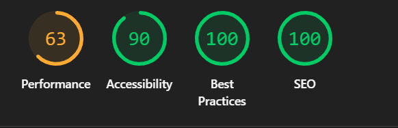
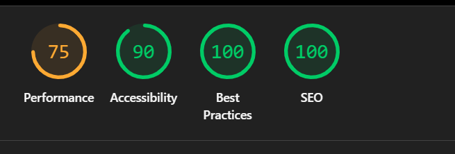

# SEO e Acessibilidade em Páginas Web

## 1 Introdução
O SEO (Search Engine Optimization) consiste em um conjunto de técnicas estruturais aplicadas no código-fonte para que os motores de busca compreendam e posicionem a página web de maneira eficiente. A acessibilidade web, por sua vez, foca no desenvolvimento de interfaces inclusivas, permitindo que qualquer pessoa, independentemente de limitações físicas ou cognitivas, consiga navegar e interagir de forma autônoma. A integração de ambos os conceitos garante que o projeto cumpra seu propósito social, alcançando o maior número de pessoas sem barreiras técnicas.

## 2 SEO
- **Title:** Tag que define o título oficial do documento, exibido na aba do navegador e como título principal nos resultados de busca orgânica.
- **Meta description:** Breve resumo do conteúdo da página, utilizado pelos buscadores para exibir um panorama sobre o site logo abaixo do título.
- **Hierarquia de títulos (h1, h2, h3...):** Organização estrutural que dita a ordem de importância das informações; o `h1` deve ser único e representar o tema principal.
- **Conteúdo relevante:** Textos semânticos, originais e bem estruturados que respondam diretamente à intenção de busca do usuário.
- **Links compreensíveis:** Textos de âncora descritivos que deixam claro para onde o usuário será levado, abolindo o uso de termos vagos como "clique aqui".
- **Organização e estrutura do documento HTML:** Uso coerente de elementos que dividem o conteúdo logicamente, facilitando a indexação.

## 3 Acessibilidade
- **HTML semântico:** Substituição de tags genéricas (`
`) por tags com significado próprio (`<header>`, `<main>`, `<nav>`, `<footer>`), permitindo que leitores de tela compreendam a estrutura.
- **Atributo alt em imagens:** Texto descritivo que narra o conteúdo visual da imagem, fundamental para usuários com deficiência visual.
- **Contraste:** Diferença tonal mínima recomendada entre a cor do texto e a cor do fundo para garantir legibilidade.
- **Navegação por teclado:** Possibilidade de acessar todos os links, botões e controles interativos utilizando apenas a tecla Tab.
- **Definição do idioma da página:** Atributo `lang` no elemento `<html>` que orienta os sintetizadores de voz sobre a pronúncia correta.
- **Labels em formulários:** Rótulos textuais vinculados aos campos de entrada para que o usuário entenda o que precisa ser digitado.
- **WCAG:** Web Content Accessibility Guidelines, o manual de diretrizes internacionais que padroniza os critérios de inclusão digital.

## 4 Análise da landing page
- **Pontos Positivos e Boas Práticas:** O projeto "Conecta Respeito" atende fortemente à marcação semântica, possuindo um único `<h1>`, uso correto da tag `<nav>` no cabeçalho e `<main>` para o conteúdo. Todas as imagens possuem atributos `alt` informativos, e a paleta de cores oferece excelente contraste lido pelos testadores.
- **Problemas Encontrados:** O peso original dos arquivos de imagem impactou inicialmente o tempo de carregamento da página em conexões móveis.
- **Pontos de Melhoria:** A implementação futura de formatos de imagem de nova geração (como WebP) ou *lazy loading* pode elevar a métrica de Desempenho.

## 5 Melhorias aplicadas ou propostas
Para adequar a página aos padrões, foram aplicados os atributos `lang="pt-BR"` na tag raiz e configuradas as metatags de `description` e `viewport` no `<head>`. Como proposta de evolução contínua (visto que o Lighthouse retornou Desempenho Mobile 63), sugere-se a compressão em lote dos arquivos armazenados na pasta `assets/images/` para garantir carregamento instantâneo em redes 3G.

## 6 Evidências

Abaixo estão os resultados automatizados da ferramenta Google Lighthouse aferidos sobre a Landing Page:

| Dispositivo | Desempenho (Performance) | Acessibilidade | Melhores Práticas | SEO |
| :--- | :---: | :---: | :---: | :---: |
| **Mobile** | 63 | 90 | 100 | 100 |
| **Desktop** | 75 | 90 | 100 | 100 |

### Relatórios Visuais (Lighthouse)

**Evidência Mobile:**

**Evidência Desktop:**

### Checklist Mínimo de Verificação
- [x] Idioma definido corretamente no HTML
- [x] Título da página
- [x] Meta description
- [x] Existência de apenas um h1 principal
- [x] Textos alternativos nas imagens
- [x] Clareza dos links
- [x] Contraste entre texto e fundo
- [x] Responsividade
- [x] Possibilidade de navegação utilizando teclado
- [x] Utilização de referências confiáveis

## 7 Referências
- W3C. Web Content Accessibility Guidelines (WCAG) 2.2. Disponível em: https://www.w3.org/TR/WCAG22/.
- GOOGLE. Google Search Central: SEO Starter Guide. Disponível em: https://developers.google.com/search/docs/fundamentals/seo-starter-guide.
- MDN WEB DOCS. <meta>: The metadata element. Disponível em: https://developer.mozilla.org/en-US/docs/Web/HTML/Reference/Elements/meta.

## 8 Declaração de Uso de Inteligência Artificial
Declaro que ferramentas de Inteligência Artificial Generativa foram utilizadas estritamente como suporte técnico auxiliar para organização estrutural deste documento, formatação em sintaxe Markdown e revisão teórica de conceitos web. A estruturação do código HTML, aplicação do Bootstrap, testes do Lighthouse, análises de layout e autoria da documentação final foram desenvolvidas e conferidas sob minha inteira responsabilidade técnica.